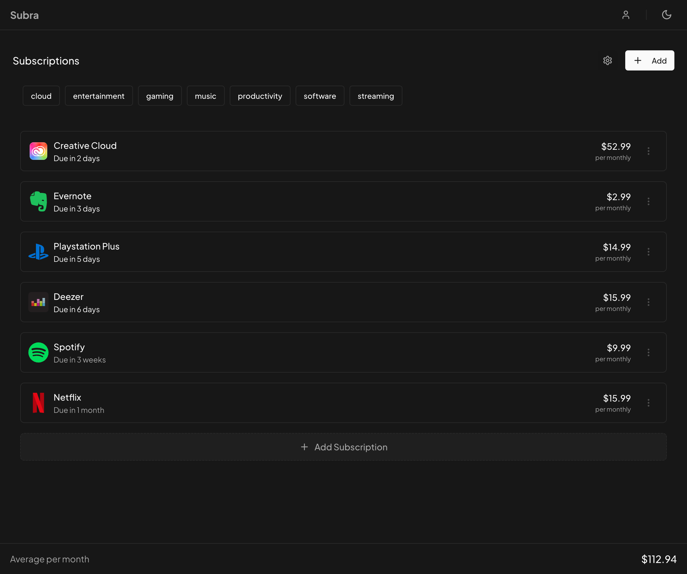

<div align="center">
  
  <br/>
  [](https://github.com/hamzasaleem2/subra-local#using-docker)
  [](https://opensource.org/licenses/MIT)
  [](https://www.typescriptlang.org/)
  [](https://react.dev)
  <br/>
  

</div>

## About

Subra is a powerful subscription management tool that helps you take control of your recurring expenses. This repository contains the local-first version of Subra, which stores data in your browser's local storage.

Looking for a hosted solution? Check out [Subra.app](https://subra.app) for our cloud-based service with additional features!

### ✨ [Live Demo](https://local.subra.app) | 🚀 [Get Started](https://subra.app)

## Features

- 🔒 Local-first approach - your data stays on your device
- 💳 Track multiple subscriptions with ease
- 🌍 Multi-currency support
- ⏰ Payment due reminders
- 📊 Subscription analytics dashboard
- 🐳 Docker support for easy deployment

## Quick Start

### Prerequisites

- Node.js 18 or later
- pnpm (recommended) or npm
- Docker (optional)

### One-Click Deploy

Deploy your own instance of Subra with Docker:

```bash
docker run -d -p 80:80 ghcr.io/hamzasaleem2/subra-local:latest
```

[](https://cloud.digitalocean.com/apps/new?repo=https://github.com/hamzasaleem2/subra-local/tree/main)

### Local Development

```bash
# Clone the repository
git clone https://github.com/hamzasaleem2/subra-local.git
cd subra-local

# Install dependencies
pnpm install

# Start development server
pnpm dev
```

Visit `http://localhost:5173` in your browser.

### Using Docker

For development:
```bash
docker compose up
```

For production:
```bash
docker build -t subra-local .
docker run -p 80:80 subra-local
```

## Premium Features at [Subra.app](https://subra.app)

While this open-source version provides essential features for personal use, our hosted solution at [Subra.app](https://subra.app) offers additional benefits:

### Free Plan
- Track up to 5 subscriptions
- Multi-currency support
- Payment due reminders
- Advanced dashboard

### Pro Plan ($7/month - Limited Time 65% Off)
- Unlimited subscriptions
- Export subscription data
- Priority support
- Early access to new features

[Start Free at Subra.app](https://subra.app) • [View Pricing](https://subra.app)

## Project Structure

```
subra-local/
├── src/
│   ├── components/    # Reusable UI components
│   ├── pages/        # Page components
│   ├── layouts/      # Layout components
│   ├── lib/          # Utilities and helpers
│   ├── App.tsx       # Main application component
│   └── main.tsx      # Application entry point
├── public/           # Static assets
└── config files      # Configuration files
```

## Technologies

- [React](https://react.dev)
- [TypeScript](https://www.typescriptlang.org/)
- [Vite](https://vitejs.dev/)
- [Radix UI](https://www.radix-ui.com/)
- [Tailwind CSS](https://tailwindcss.com/)
- [Framer Motion](https://www.framer.com/motion/)
- [React Router](https://reactrouter.com/)
- [Docker](https://www.docker.com/)

## Contributing

We welcome contributions! See our [Contributing Guidelines](CONTRIBUTING.md) for details.

## License

This project is licensed under the MIT License - see the [LICENSE](LICENSE) file for details.

## Support

- 🐛 [Report a bug](https://github.com/hamzasaleem2/subra-local/issues)
- 💡 [Request a feature](https://github.com/hamzasaleem2/subra-local/issues/new?labels=enhancement)
- 📧 [Contact support](mailto:hamzasaleembusiness@gmail.com)

## FAQ

**Q: What happens when I reach 5 subscriptions on the free plan?**  
A: You'll need to upgrade to the Pro plan to add more subscriptions.

**Q: Can I switch between plans?**  
A: Yes, you can upgrade or downgrade at any time.

**Q: Is my data secure?**  
A: Yes! The local version stores data only on your device.

**Q: Do you offer refunds?**  
A: Yes, we offer a 14-day money-back guarantee, no questions asked.

---

<div align="center">

### ⭐ Star us on GitHub — it motivates us a lot!

[Website](https://subra.app) • [Twitter](https://twitter.com/_hamza_saleem)

</div>
